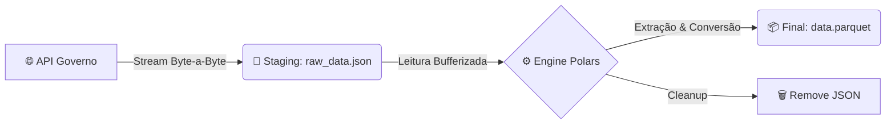

# 🏛️ Pipeline de dados governamentais


Pipeline ETL (Extract, Transform, Load) de alta performance escrito em Rust, projetado para ingerir dados governamentais massivos com **consumo mínimo de memória RAM**.

Ao contrário de abordagens tradicionais que carregam todo o dataset em memória, este projeto utiliza uma arquitetura de **Streaming IO** e **Staging em Disco**, permitindo processar Gigabytes de dados mesmo em máquinas com recursos limitados.

## 🚀 Destaques Técnicos

* **Zero-RAM Overhead:** O download utiliza `std::io::copy` com buffers de streaming. Os dados fluem da rede direto para o disco (Staging Area).
* **Polars Engine:** Utiliza o poder do [Polars](https://pola.rs/) para inferência de esquema (Schema Inference) e processamento tabular ultra-rápido.
* **Storage Optimization:** Converte JSONs verbosos para **Parquet** com compressão **ZSTD**, reduzindo o armazenamento em até 60%.
* **Robustez:** Proteção contra listas vazias, reconexão HTTP (Keep-Alive) e tratamento de erros contextual.

## 🛠️ Arquitetura do Pipeline



1. **Ingestão (Extract):** Download streamado com barra de progresso visual (`indicatif`).
2. **Transformação (Transform):** Leitura do JSON bruto, extração do payload `resultado` e conversão de tipos.
3. **Carga (Load):** Escrita otimizada em Parquet/ZSTD e limpeza automática de artefatos.

## 📦 Instalação

Certifique-se de ter o [Rust e Cargo](https://rustup.rs/) instalados.

```bash
# 1. Clone o repositório
git clone https://github.com/owilliangoncalves/Rust-ETL.git
cd Rust-ETL

# 2. Compile em modo Release (Essencial para performance do Polars)
cargo build --release

```

## ⚙️ Configuração

O sistema opera baseado em um arquivo JSON que mapeia os recursos da API.

⚠️ Validação de Endpoints
> API do governo pode sofrer alterações. Sempre verifique os nomes dos recursos e parâmetros disponíveis na documentação oficial:
> [Dados Abertos Compras](https://dadosabertos.compras.gov.br/swagger-ui/index.html#/)

Crie um arquivo `config.json` na raiz do projeto:

```json
{
  "base_url": "https://dadosabertos.compras.gov.br",
  "endpoints": {
    "materiais": "url",
    "[FOO]": "[FOO]"
  }
}
```

## ▶️ Como Usar

### Execução Padrão

Busca automaticamente pelo arquivo `config.json` na raiz:

```bash
cargo run --release
```

### Configuração Personalizada

Você pode passar o caminho de um arquivo de configuração específico como argumento:

```bash
cargo run --release --config.json

```

## 📂 Estrutura do Código

O projeto é modularizado para facilitar a manutenção e testes:

* **`src/main.rs`**: O Orquestrador. Gerencia CLI args, ciclo de vida, criação de diretórios e conexão HTTP reutilizável.
* **`src/api.rs`**: Camada de Transporte. Responsável por downloads resilientes, streaming e feedback visual.
* **`src/analysis.rs`**: Camada de Lógica. Contém as regras de negócio para extrair dados do envelope JSON e interagir com o Polars.
* **`src/models.rs`**: Definições de Tipos. Structs serializáveis que garantem a integridade da configuração.

## 🛡️ Tratamento de Erros

O pipeline implementa uma estratégia **"Fail-Soft"**:

1. Se um download falhar (ex: 404), o erro é logado e o pipeline avança para o próximo endpoint.
2. Se a API retornar uma lista vazia `[]`, o arquivo Parquet não é gerado (evitando sujeira).
3. Erros de I/O (disco cheio, permissão) são reportados com contexto detalhado.


---

*Desenvolvido com 🦀 Rust e Foco em Performance.*
